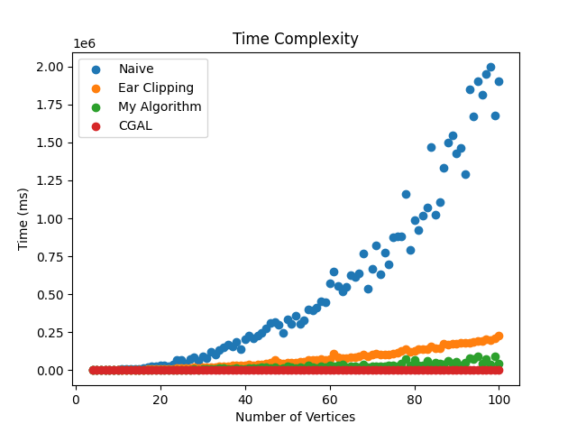

# Triangulation of a Polygon

## Overview

In this assignment I implemented three different algorithms for triangulating a polygon. The algorithms are as follows:
1. ***[Naive Algorithm](triangulation_n4.cpp)***
2. ***[Ear-Clipping](triangulation_n2.cpp)***
3. ***[Recursive Algorithm](triangulation_my.cpp)***

## How to Run
1. **Cleaning the existing outputs**
To get the correct implementation you first need to clean the existing outputs. You can do this by running the following command:
```bash
./cleaning.sh
```

2. **Compiling the code** 
Then you can run the following command to compile the code:
```bash
./running.sh
```

## Code Breakdown
1. **Naive Algorithm**
    * The naive algorithm is implemented in the file ***[triangulation_n4.cpp](triangulation_n4.cpp)***.
    * The algorithm is simple and has a time complexity of $O(n^4)$. 
    * The algorithm works by checking all possible ${n \choose 2}$ diagonals $O(n^2)$ time.
    * For every diagonal we need to check if is intersecting other sides or not which takes $O(n)$ time.
    * We also need to check whether the diagonal is inside the polygon or not which takes $O(n)$ time.
    * The algorithm is simple but very slow for large polygons.


2. **Ear-Clipping Algorithm**
    * The ear-clipping algorithm is implemented in the file ***[triangulation_n2.cpp](triangulation_n2.cpp)***.
    * The algorithm is faster than the naive algorithm and has a time complexity of $O(n^2)$.
    * The algorithm works by finding an ear of the polygon and then cutting it off.
    * One of the adjacent vertices of the ear will become a new ear.
    * The algorithm continues until there are no ears left.
    * There are $n$ ears in a polygon and each ear takes $O(n)$ time to find.
    * The overall running time of the algorithm is $O(n^2)$.

3. **Recursive Algorithm**
    * The recursive algorithm is implemented in the file ***[triangulation_my.cpp](triangulation_my.cpp)***.
    * The algorithm is faster than the ear-clipping algorithm
    * The algorithm works by dividing the polygon into two smaller polygons.
    * The algorithm then triangulates the two smaller polygons recursively.
    * The algorithm then merges the two triangulations to get the final triangulation.
    * The algorithm is faster than the ear-clipping algorithm because it divides the polygon into two smaller polygons.
    * The overall running time of the algorithm follows the recurrence relation $$T(n) = T(x) + T(n-x) + O(x)$$.

4. **Visualizing the Triangulation**
    * The visualisation is implemented in the file ***[visualisation.py](visualisation.py)***.
    * The visualisation is done using the matplotlib library.
    * The visualisation shows the original polygon and the triangulation of the polygon.

5. **Cleaning the Outputs**
    * The cleaning script is implemented in the file ***[cleaning.sh](cleaning.sh)***.
    * The cleaning script removes the existing outputs.

6. **Compiling the Code**
    * The compiling script is implemented in the file ***[running.sh](running.sh)***.
    * The compiling script compiles the code and generates the outputs.

## Results
1. **Triangulations**
    * The visualisation of the triangulations can be found in the folder ***[gifs](/gifs/)***.
    * The visualisation shows the original polygon and the triangulation of the polygon.

2. **Running Time**
    * The running time of the algorithms can be found in the file ***[time.txt](time.txt)***.
    * The running time of the algorithms is measured in milliseconds.

3. **Testing on 100 testcases**
    * This algorithm is tested on 100 testcases.
    * The results of the testcases can be found in the folder ***[100_tests](/100_tests/)***.
    * The folder contains the input testcases and outputs of the triangulations.
    
## Conclusion

The below plots show the running time of the three algorithms for different values of $n$.


This plot shows the running time of the three algorithms for different values of $n$ on the smaller testcases. (You can try implementing this on your own machine)


This plot shows the running time of the three algorithms for different values of $n$ on the 100 testcases. (If you have computational power and time try running this by modifiying the code in [running.sh](/running.sh) and [visualisation.py](/visualisation.py)).


This plot shows the running time of the `Ear Clipping` and `Recursive Algorithm` algorithms for different values of $n$ on the 100 testcases.

